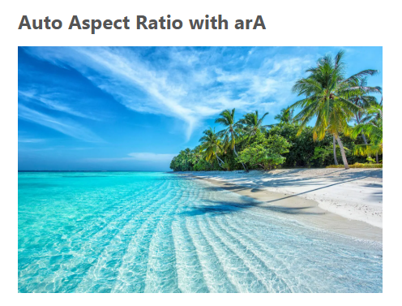
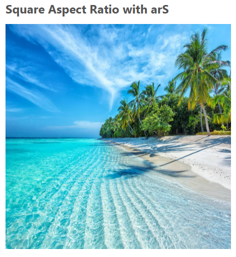
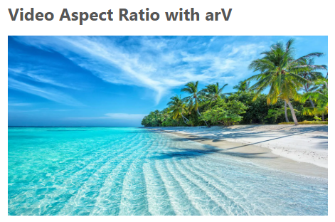
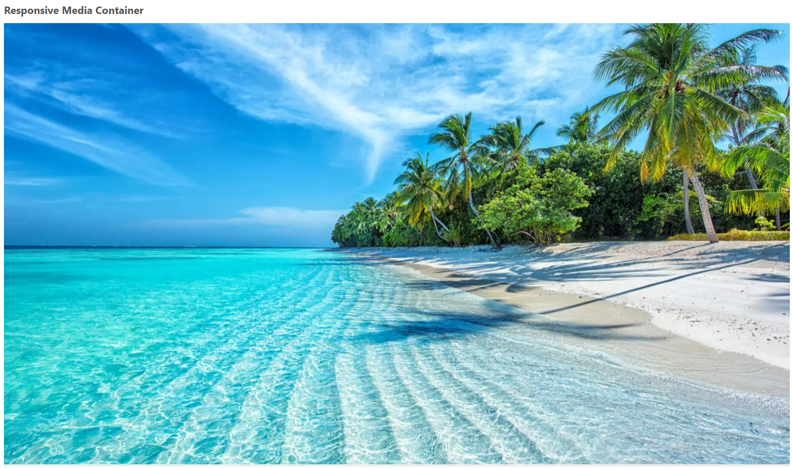
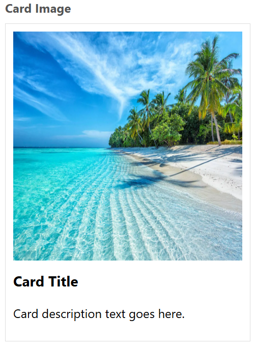

- **Property:** aspect-ratio
- **Shorthand:** ar  
  Utilities for controlling the aspect ratio of an element.

```css
arA {
  aspect-ratio: auto;
}
arS {
  aspect-ratio: 1 / 1;
}
arV {
  aspect-ratio: 16 / 9;
}
```

The `aspect-ratio` property sets a preferred aspect ratio for the box, which will be used in the calculation of auto sizes and some other layout functions.

## Usage Examples

### Auto Aspect Ratio with arA

```html

```

With `arA`, the element maintains its natural aspect ratio. For images, this is determined by the image's intrinsic dimensions.



_The image displays with its natural aspect ratio._

### Square Aspect Ratio with arS

```html

```

The `arS` class forces the element to maintain a 1:1 (square) aspect ratio regardless of its content.



_The image is constrained to a perfect square shape._

### Video Aspect Ratio with arV

```html

```

The `arV` class applies a 16:9 aspect ratio, commonly used for video content and widescreen displays.



_The image is displayed with a 16:9 widescreen aspect ratio._

## Practical Applications

### Responsive Media Containers

```html
<div class="arV w100% bgcGray">
  
</div>
```

Using aspect ratio utilities with percentage widths creates responsive containers that maintain their proportions at any screen size.



_The container maintains a 16:9 aspect ratio while scaling responsively with the viewport width._

### Card Images

```html
<div class="w300px bd1px bdcGray p10px">
  
  <h3 class="mT10px">Card Title</h3>
  <p>Card description text goes here.</p>
</div>
```

Aspect ratio utilities are perfect for maintaining consistent image dimensions in card layouts.



_The square aspect ratio ensures all card images have consistent dimensions regardless of the source image proportions._
