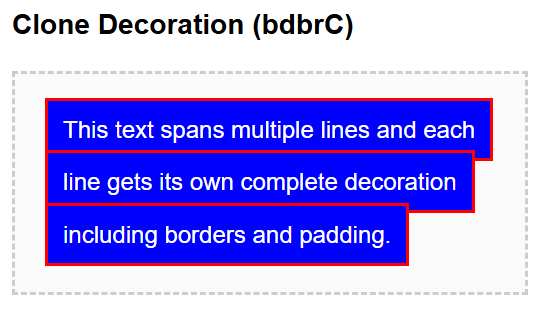
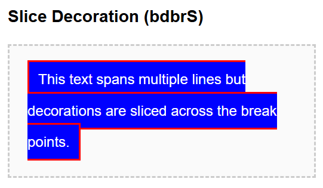

- **Property:** box-decoration-break
- **Shorthand:** bdbr  
  Utilities for controlling how element decorations are rendered when broken across lines, columns, or pages.

```css
bdbrC {
  box-decoration-break: clone;
}
bdbrS {
  box-decoration-break: slice;
}
```

The `box-decoration-break` property controls how decorations (background, border, padding, margin) are rendered when an element is broken across multiple lines, columns, or pages.

## Clone Decoration

```css
bdbrC {
  box-decoration-break: clone;
}
```

**Example:**

```html
<span class="bdbrC bgcBlue cWhite p10px bd2px;solid;#333">
  This text spans multiple lines and each line gets its own complete decoration
  including borders and padding.
</span>
```



## Slice Decoration

```css
bdbrS {
  box-decoration-break: slice;
}
```

**Example:**

```html
<span class="bdbrS bgcBlue cWhite p10px bd2px;solid;#333">
  This text spans multiple lines but decorations are sliced across the break
  points.
</span>
```


