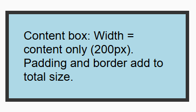
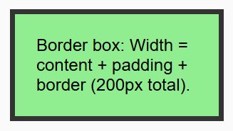
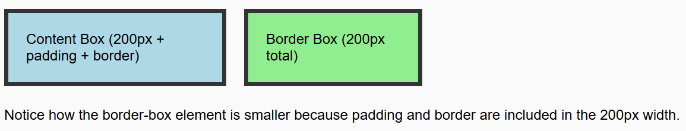

- **Property:** box-sizing
- **Shorthand:** bxsz  
  Utilities for controlling how the total width and height of an element is calculated.

```css
bxszContent-Box {
  box-sizing: content-box;
}
bxszBorder-Box {
  box-sizing: border-box;
}
```

The `box-sizing` property controls whether padding and borders are included in an element's total width and height calculation. This is fundamental for predictable layouts and responsive design.

## Content Box

```css
bxszContent-Box {
  box-sizing: content-box;
}
```

**Example:**

```html
<div class="bxszContent-Box w200px p20px bd5px;solid;#333 bgcLightBlue">
  Content box: Width = content only (200px). Padding and border add to total
  size.
</div>
```



## Border Box

```css
bxszBorder-Box {
  box-sizing: border-box;
}
```

**Example:**

```html
<div class="bxszBorder-Box w200px p20px bd5px;solid;#333 bgcLightGreen">
  Border box: Width = content + padding + border (200px total).
</div>
```



## Comparison


