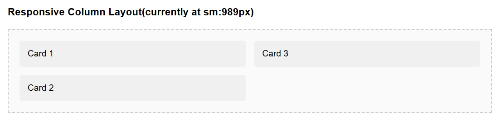

- **Property:** columns
- **Shorthand:** col
  Utilities for controlling CSS multi-column layout properties.

```css
colA {
  columns: auto;
}
```

The `columns` property creates multi-column layouts. Use column utilities to control count, width, spacing, rules, and content flow.

## Column Count

```css
colc<vCSS > {
  column-count: <vCSS>;
}
```

**Example:**

```html
<div class="colc3">
  <p>
    Content automatically divided into 3 columns. Lorem ipsum dolor sit amet,
    consectetur adipiscing elit.
  </p>
  <p>
    Additional content flows naturally across the columns with automatic height
    balancing.
  </p>
</div>
```


## Column Width

```css
colw<vCSS > {
  column-width: <vCSS>;
}
```

**Example:**

```html
<div class="colw200px">
  <p>
    Creates columns approximately 200px wide. Browser determines column count
    based on container width.
  </p>
</div>
```


## Column Gap

```css
colg<vCSS > {
  column-gap: <vCSS>;
}
```

**Example:**

```html
<div class="colc2 colg50px">
  <p>Two-column layout with 50px spacing between columns.</p>
  <p>Two-column layout with 50px spacing between columns.</p>
</div>
```


## Column Rule

```css
colr<vCSS > {
  column-rule: <vCSS>;
}
colrw<vCSS > {
  column-rule-width: <vCSS>;
}
colrs<vCSS > {
  column-rule-style: <vCSS>;
}
colrc<vCSS > {
  column-rule-color: <vCSS>;
}
```

**Example:**

```html
<div class="colc2 colr1px;solid;#ccc">
  <p>Columns with a 1px solid gray rule between them.</p>
</div>
```


## Column Span

```css
cols<vCSS > {
  column-span: <vCSS>;
}
```

**Example:**

```html
<div class="colc3">
  <h2 class="colsAll">This heading spans all columns</h2>
  <p>This content flows in the normal column layout.</p>
</div>
```


## Column Fill

```css
colf<vCSS > {
  column-fill: <vCSS>;
}
```

**Example:**

```html
<div class="colc3 colfAuto">
  <p>Content fills columns sequentially rather than balancing height.</p>
</div>
```


## Responsive Columns

**Example:**

```html
<div class="xs:colc1 sm:colc2 lg:colc1">
  <div>Card 1</div>
  <div>Card 2</div>
  <div>Card 3</div>
</div>
```


