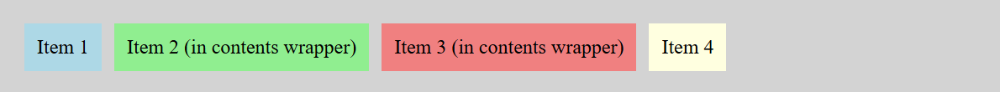

- **Property:** display
- **Shorthand:** d
  Utilities for controlling the display type of an element.

```css
dB {
  display: block;
}
dI {
  display: inline;
}
dIb {
  display: inline-block;
}
dF {
  display: flex;
}
dIf {
  display: inline-flex;
}
dG {
  display: grid;
}
dIg {
  display: inline-grid;
}
dFr {
  display: flow-root;
}
dT {
  display: table;
}
dIt {
  display: inline-table;
}
dTr {
  display: table-row;
}
dTcell {
  display: table-cell;
}
dTcp {
  display: table-caption;
}
dTcol {
  display: table-column;
}
dTcolg {
  display: table-column-group;
}
dThg {
  display: table-header-group;
}
dTrg {
  display: table-row-group;
}
dTfg {
  display: table-footer-group;
}
dC {
  display: contents;
}
dLi {
  display: list-item;
}
dN {
  display: none;
}
```

The `display` property controls how an element is displayed and how it participates in layout. This is fundamental for creating layouts and controlling element behavior.

## Text Flow Display Types

**Example:**

```html
<p>
  When controlling the flow of text, using the CSS property
  <span class="dI">display: inline</span> will cause the text inside the element
  to wrap normally.
</p>
<p>
  While using the property
  <span class="dIb">display: inline-block will wrap the element</span> to
  prevent the text inside from extending beyond its parent.
</p>
<p>
  Lastly, using the property <span class="dB">display: block</span> will put the
  element on its own line and fill its parent.
</p>
```


## Flex Display

```css
dF {
  display: flex;
}
```

**Example:**

```html
<div class="dF gap20px p20px bgcLightGray bd1px;solid;#333">
  <div class="p10px bgcLightBlue">Flex Item 1</div>
  <div class="p10px bgcLightGreen">Flex Item 2</div>
  <div class="p10px bgcLightCoral">Flex Item 3</div>
</div>
```


## Grid Display

```css
dG {
  display: grid;
}
```

**Example:**

```html
<div class="dG gtc1fr;1fr gap20px p20px bgcLightGray bd1px;solid;#333">
  <div class="p10px bgcLightBlue">Grid Item 1</div>
  <div class="p10px bgcLightGreen">Grid Item 2</div>
  <div class="p10px bgcLightCoral">Grid Item 3</div>
  <div class="p10px bgcLightYellow">Grid Item 4</div>
</div>
```


## Inline Flex Display

```css
dIf {
  display: inline-flex;
}
```

**Example:**

```html
<p>
  This is inline text with an
  <span class="dIf gap10px p10px bgcLightGray bd1px;solid;#333">
    <span class="p5px bgcLightBlue">Item 1</span>
    <span class="p5px bgcLightGreen">Item 2</span>
  </span>
  inline flex container that flows with the text.
</p>
```


## Inline Grid Display

```css
dIg {
  display: inline-grid;
}
```

**Example:**

```html
<p>
  This is inline text with an
  <span class="dIg gtc1fr;1fr gap5px p10px bgcLightGray bd1px;solid;#333">
    <span class="p5px bgcLightBlue">A</span>
    <span class="p5px bgcLightGreen">B</span>
    <span class="p5px bgcLightCoral">C</span>
    <span class="p5px bgcLightYellow">D</span>
  </span>
  inline grid container that flows with the text.
</p>
```


## Flow Root Display

```css
dFr {
  display: flow-root;
}
```

The `flow-root` display value creates a new block formatting context, which is useful for containing floated elements and preventing margin collapse. It's particularly helpful when you need to clear floats without using additional markup.

**Example:**

```html
<div class="dFr p20px bgcLightGray bd1px;solid;#333">
  <div class="flL w100px h100px bgcLightBlue">Floated element</div>
  <p>
    Flow-root creates a new block formatting context that contains floated
    elements and prevents them from escaping their container.
  </p>
</div>
```


## Table Display

```css
dT {
  display: table;
}
dIt {
  display: inline-table;
}
dTr {
  display: table-row;
}
dTcell {
  display: table-cell;
}
dTcp {
  display: table-caption;
}
dTcol {
  display: table-column;
}
dTcolg {
  display: table-column-group;
}
dThg {
  display: table-header-group;
}
dTrg {
  display: table-row-group;
}
dTfg {
  display: table-footer-group;
}
```

The table display utilities allow you to create table-like layouts using CSS display properties. This is useful when you need table semantics without using actual HTML table elements, or when you want to apply table layout to non-table elements.

**Basic Table Example:**

```html
<div class="dT w100% bd1px;solid;#333">
  <div class="dTr">
    <div class="dTcell p10px bgcLightBlue bd1px;solid;#333">Cell 1</div>
    <div class="dTcell p10px bgcLightGreen bd1px;solid;#333">Cell 2</div>
  </div>
  <div class="dTr">
    <div class="dTcell p10px bgcLightCoral bd1px;solid;#333">Cell 3</div>
    <div class="dTcell p10px bgcLightYellow bd1px;solid;#333">Cell 4</div>
  </div>
</div>
```


**Complete Table Structure Example:**

```html
<div class="dT w100% bd1px;solid;#333">
  <div class="dTcp p10px bgcLightGray bd1px;solid;#333 tac fw700">
    Table Caption
  </div>
  <div class="dThg">
    <div class="dTr">
      <div class="dTcell p10px bgcLightBlue bd1px;solid;#333 fw700">
        Header 1
      </div>
      <div class="dTcell p10px bgcLightBlue bd1px;solid;#333 fw700">
        Header 2
      </div>
    </div>
  </div>
  <div class="dTrg">
    <div class="dTr">
      <div class="dTcell p10px bgcLightGreen bd1px;solid;#333">Data 1</div>
      <div class="dTcell p10px bgcLightGreen bd1px;solid;#333">Data 2</div>
    </div>
  </div>
  <div class="dTfg">
    <div class="dTr">
      <div class="dTcell p10px bgcLightCoral bd1px;solid;#333 fw700">
        Footer 1
      </div>
      <div class="dTcell p10px bgcLightCoral bd1px;solid;#333 fw700">
        Footer 2
      </div>
    </div>
  </div>
</div>
```


## Contents Display

```css
dC {
  display: contents;
}
```

The `contents` display value makes the element's children appear as if they were direct children of the element's parent, effectively removing the element from the layout tree while keeping its children.

**Example:**

```html
<div class="dF gap10px p20px bgcLightGray bd1px;solid;#333">
  <div class="p10px bgcLightBlue">Item 1</div>
  <div class="dC">
    <div class="p10px bgcLightGreen">Item 2 (in contents wrapper)</div>
    <div class="p10px bgcLightCoral">Item 3 (in contents wrapper)</div>
  </div>
  <div class="p10px bgcLightYellow">Item 4</div>
</div>
```



## List Item Display

```css
dLi {
  display: list-item;
}
```

The `list-item` display value makes any element behave like a list item, including generating a marker box (bullet point or number).

**Example:**

```html
<div class="p20px bgcLightGray bd1px;solid;#333">
  <div class="dLi p5px">This div behaves like a list item</div>
  <div class="dLi p5px">Another list item div</div>
  <div class="dLi p5px">Third list item div</div>
</div>
```


## None Display

```css
dN {
  display: none;
}
```

**Example:**

```html
<div class="p10px bgcLightBlue">Visible element</div>
<div class="dN p10px bgcRed">Hidden element</div>
<div class="p10px bgcLightGreen">Another visible element</div>
```


