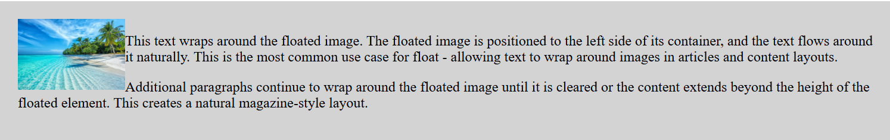
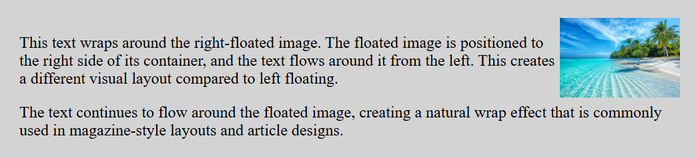
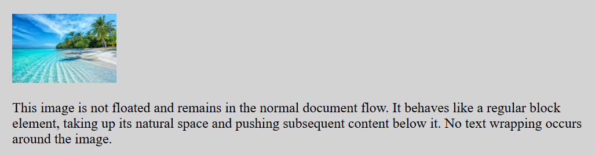
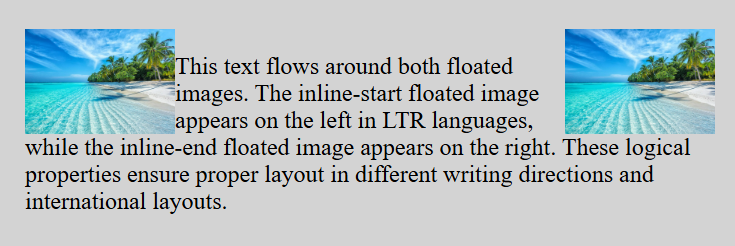
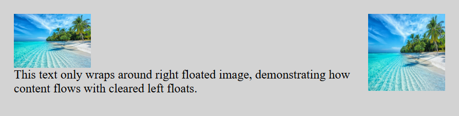

- **Property:** float
- **Shorthand:** fl  
  Utilities for controlling the float behavior of elements.

```css
flL {
  float: left;
}
flR {
  float: right;
}
flN {
  float: none;
}
flIs {
  float: inline-start;
}
flIe {
  float: inline-end;
}
```

The `float` property specifies how an element should float within its container. Floating elements are taken out of the normal document flow and positioned to the left or right of their container, allowing other content to wrap around them.

## Float Left

```css
flL {
  float: left;
}
```

**Example:**

```html
<div class="p20px bgcLightGray brd1px;solid;#333">
  
  <p>
    This text wraps around the floated element. The floated element is
    positioned to the left side of its container, and the text flows around it
    naturally. This is useful for creating layouts where you want text to wrap
    around images or other content blocks.
  </p>
  <p>
    Additional paragraphs continue to wrap around the floated element until it
    is cleared or the content extends beyond the height of the floated element.
  </p>
</div>
```



## Float Right

```css
flR {
  float: right;
}
```

**Example:**

```html
<div class="p20px bgcLightGray brd1px;solid;#333">
  
  <p>
    This text wraps around the right-floated element. The floated element is
    positioned to the right side of its container, and the text flows around it
    from the left. This creates a different visual layout compared to left
    floating.
  </p>
  <p>
    The text continues to flow around the floated element, creating a natural
    wrap effect that is commonly used in magazine-style layouts.
  </p>
</div>
```



## Float None

```css
flN {
  float: none;
}
```

**Example:**

```html
<div class="p20px bgcLightGray brd1px;solid;#333">
  
  <p>
    This element is not floated and remains in the normal document flow. It
    behaves like a regular block element, taking up the full width of its
    container and pushing subsequent content below it.
  </p>
</div>
```



## Inline Start and End Float

```css
flIs {
  float: inline-start;
}
flIe {
  float: inline-end;
}
```

The `inline-start` and `inline-end` values are logical properties that adapt to the writing direction of the document. In left-to-right languages, `inline-start` behaves like `left` and `inline-end` behaves like `right`.

**Example:**

```html
<div class="p20px bgcLightGray brd1px;solid;#333">
  
  
  <p>
    This text flows around both floated elements. The inline-start floated
    element appears on the left in LTR languages, while the inline-end floated
    element appears on the right. These logical properties ensure proper layout
    in different writing directions.
  </p>
</div>
```



## Clear Utilities

```css
clr<vCSS > {
  clear: <vCSS>;
}
```

Clear utilities are used to control how elements behave in relation to floated elements. Common clear values include:

- `clrLeft` - Clear left floats
- `clrRight` - Clear right floats
- `clrBoth` - Clear both left and right floats
- `clrNone` - No clearing

**Example with Clear Both:**

```html
<div class="p20px bgcLightGray brd1px;solid;#333">
  
  
  <p class="clrLeft">
    This text only wraps around right floated image, demonstrating how content
    flows with cleared left floats.
  </p>
</div>
```


