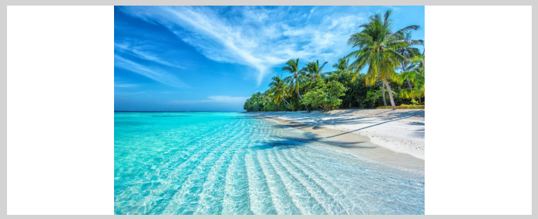

- **Property:** object-fit
- **Shorthand:** objf  
  Utilities for controlling how replaced elements (like images) should be resized to fit their container.

```css
ofC {
  object-fit: contain;
}
ofCv {
  object-fit: cover;
}
ofF {
  object-fit: fill;
}
ofN {
  object-fit: none;
}
ofSd {
  object-fit: scale-down;
}
```

The `object-fit` property specifies how the contents of a replaced element (such as an image or video) should be resized to fit its container. This is essential for controlling how images display within fixed-dimension containers while maintaining their aspect ratio or achieving specific visual effects.

## Object Fit Contain

```css
ofC {
  object-fit: contain;
}
```

The image is scaled to maintain its aspect ratio while fitting within the container. The entire image will be visible, but there may be empty space if the aspect ratios don't match.

**Example:**

```html
<div class="w500px h150px bgcLightGray brd1px;solid;#333">
  
</div>
```



## Object Fit Cover

```css
ofCv {
  object-fit: cover;
}
```

The image is scaled to maintain its aspect ratio while filling the entire container. Parts of the image may be clipped if the aspect ratios don't match.

**Example:**

```html
<div class="w500px h150px bgcLightGray brd1px;solid;#333">
  
</div>
```


## Object Fit Fill

```css
ofF {
  object-fit: fill;
}
```

The image is stretched to completely fill the container, potentially distorting the aspect ratio.

**Example:**

```html
<div class="w500px h150px bgcLightGray brd1px;solid;#333">
  
</div>
```


## Object Fit None

```css
ofN {
  object-fit: none;
}
```

The image retains its natural size and may be clipped if larger than the container.

**Example:**

```html
<div class="w500px h150px bgcLightGray brd1px;solid;#333">
  
</div>
```


## Object Fit Scale Down

```css
ofSd {
  object-fit: scale-down;
}
```

The image behaves as if `none` or `contain` were specified, whichever results in a smaller concrete object size.

**Example:**

```html
<div class="w500px h150px bgcLightGray brd1px;solid;#333">
  
</div>
```


