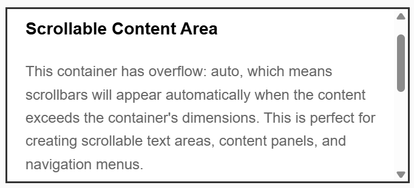
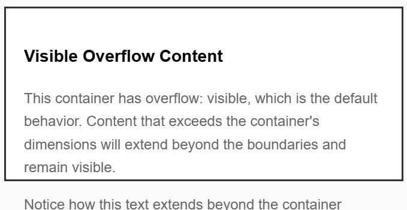
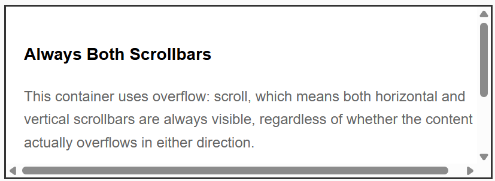
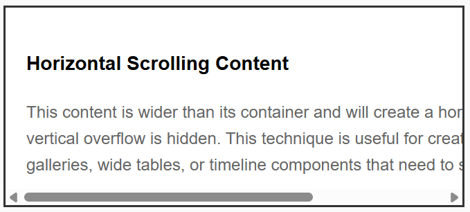
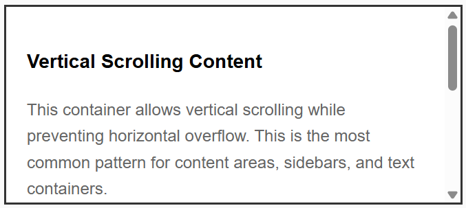

- **Property:** overflow
- **Shorthand:** ofl
  Utilities for controlling how content that overflows an element's bounds is handled.

```css
oflAuto {
  overflow: auto;
}
oflHidden {
  overflow: hidden;
}
oflVisibile {
  overflow: visible;
}
oflScroll {
  overflow: scroll;
}
oflClip {
  overflow: clip;
}
```

The `overflow` property controls what happens when content is too large to fit in an element's content area. It determines whether to clip content, show scrollbars, or let content overflow visibly.

## Overflow Auto

```css
oflAuto {
  overflow: auto;
}
```

Shows scrollbars only when content overflows. This is the most commonly used overflow value for creating scrollable containers.

**Example:**

```html
<div class="oflAuto">
  <!-- ... -->
</div>
```



## Overflow Hidden

```css
oflHidden {
  overflow: hidden;
}
```

Clips content that overflows the container. No scrollbars are shown, and overflowing content is completely hidden.

**Example:**

```html
<div class="oflHidden">
  <!-- ...  -->
</div>
```

## Overflow Visible

```css
oflVisibile {
  overflow: visible;
}
```

Content overflows the container and remains visible. This is the default behavior for most elements.

**Example:**

```html
<div class="oflVisibile">
  <!-- ... -->
</div>
```



## Overflow Scroll

```css
oflScroll {
  overflow: scroll;
}
```

Always shows scrollbars, regardless of whether content overflows. This ensures consistent layout even when content fits within the container.

**Example:**

```html
<div class="oflScroll">
  <!-- ... -->
</div>
```



## Directional Overflow Control

### Overflow X (Horizontal)

```css
oflxA {
  overflow-x: auto;
}
oflxH {
  overflow-x: hidden;
}
oflxV {
  overflow-x: visible;
}
oflxS {
  overflow-x: scroll;
}
oflxC {
  overflow-x: clip;
}
```

Controls horizontal overflow behavior independently from vertical overflow.

**Example:**

```html
<div class="oflxA oflyH">
  <!-- ... -->
</div>
```



### Overflow Y (Vertical)

```css
oflyA {
  overflow-y: auto;
}
oflyH {
  overflow-y: hidden;
}
oflyV {
  overflow-y: visible;
}
oflyS {
  overflow-y: scroll;
}
oflyC {
  overflow-y: clip;
}
```

Controls vertical overflow behavior independently from horizontal overflow.

**Example:**

```html
<div class="oflxH oflyA">
  <!-- ... -->
</div>
```


