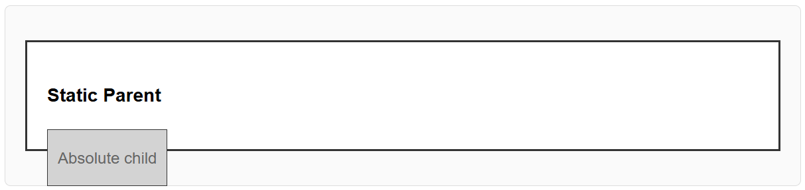
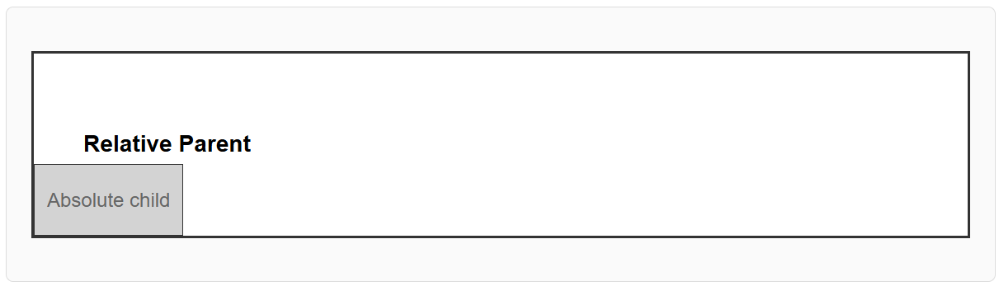
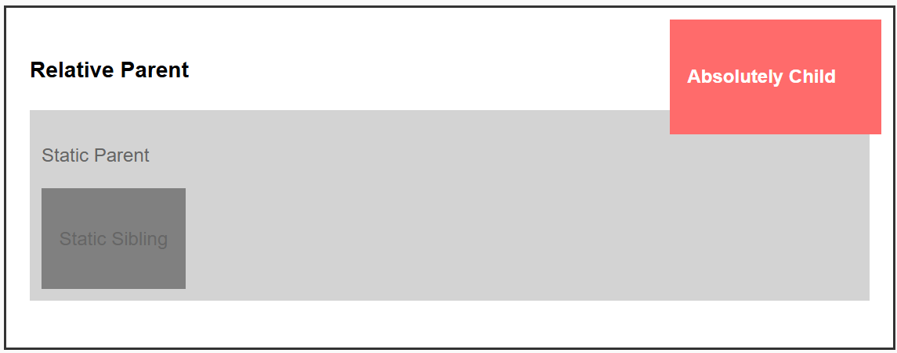

- **Property:** position
- **Shorthand:** pos
  Utilities for controlling how an element is positioned in the document flow.

```css
posS {
  position: static;
}
posF {
  position: fixed;
}
posA {
  position: absolute;
}
posR {
  position: relative;
}
posSt {
  position: sticky;
}
```

The `position` property controls how an element is positioned in the document. It determines whether an element follows the normal document flow or is positioned relative to its containing block, viewport, or other reference points.

## Position Static

```css
posS {
  position: static;
}
```

The default positioning method. Elements are positioned according to the normal document flow. Top, right, bottom, left, and z-index properties have no effect.

**Example:**

```html
<div class="posS">
  <h3>Static Parent</h3>
  <div class="posA bottom-0 left-0">
    <p>Absolute child</p>
  </div>
</div>
```



## Position Relative

```css
posR {
  position: relative;
}
```

Elements are positioned relative to their normal position in the document flow. The element still occupies its original space, but can be offset using top, right, bottom, and left properties.

**Example:**

```html
<div class="posR">
  <h3>Relative Parent</h3>
  <div class="posA bottom-0 left-0">
    <p>Absolute child</p>
  </div>
</div>
```



## Position Absolute

```css
posA {
  position: absolute;
}
```

Elements are removed from the normal document flow and positioned relative to their nearest positioned ancestor (or the viewport if no positioned ancestor exists).

**Example:**

```html
<div class="posR">
  <h3>Relative Parent</h3>
  <div class="posS">
    <p>Static Parent</p>
    <div class="posA t10px r10px">
      <h4>Absolutely Child</h4>
    </div>
    <div class="dIb">
      <p>Static Sibling</p>
    </div>
  </div>
</div>
```



## Position Fixed

```css
posF {
  position: fixed;
}
```

Elements are positioned relative to the viewport and remain in the same position even when the page is scrolled. They are removed from the normal document flow.

**Example:**

```html
<div class="posR">
  <div class="posF t0px r0px l0px">Fixed Position Element</div>
  <div>
    <!-- ... -->
  </div>
</div>
```

## Position Sticky

```css
posSt {
  position: sticky;
}
```

Elements are positioned based on the user's scroll position. They behave like relatively positioned elements until they reach a specified threshold, then become fixed.

**Example:**

```html
<div>
  <div>
    <div class="posSt t0px">Sticky 1</div>
    <div>
      <!-- ... -->
    </div>

    <div class="posSt t0px">Sticky 2</div>
    <div>
      <!-- ... -->
    </div>
  </div>
</div>
```
