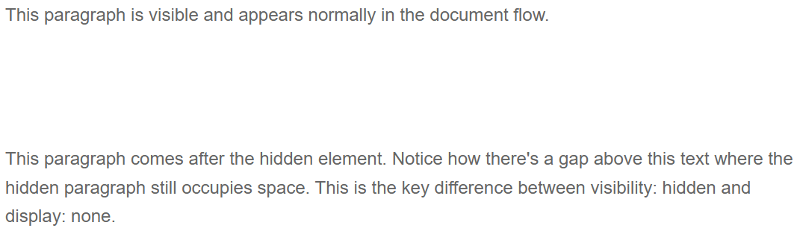
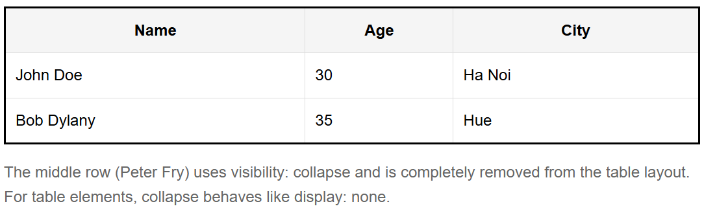

- **Property:** visibility
- **Shorthand:** v
  Utilities for controlling the visibility of elements without affecting their layout space.

```css
vH {
  visibility: hidden;
}
vC {
  visibility: collapse;
}
```

The `visibility` property controls whether an element is visible or hidden while preserving its space in the layout. Unlike `display: none`, visibility utilities maintain the element's dimensions and position in the document flow.

## Visibility Hidden

```css
vH {
  visibility: hidden;
}
```

Makes an element invisible while preserving its space in the layout. The element is not visible but still occupies its original dimensions and affects the positioning of other elements.

**Example:**

```html
<div>
  <p class="vH">
    <!-- ... -->
  </p>
</div>
```



## Visibility Collapse

```css
vC {
  visibility: collapse;
}
```

For table elements (rows, columns, row groups, column groups), this behaves like `display: none` - the element is removed and doesn't take up space. For other elements, it behaves like `visibility: hidden`.

**Example:**

```html
<div>
  <table>
    <thead>
      <tr>
        <th>Name</th>
        <th>Age</th>
        <th>City</th>
      </tr>
    </thead>
    <tbody>
      <tr>
        <td>John Doe</td>
        <td>30</td>
        <td>Ha Noi</td>
      </tr>
      <tr class="vC">
        <td>Peter Fry</td>
        <td>25</td>
        <td>Da Nang</td>
      </tr>
      <tr>
        <td>Bob Dylany</td>
        <td>35</td>
        <td>Hue</td>
      </tr>
    </tbody>
  </table>
</div>
```


