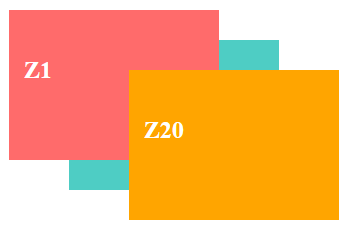

- **Property:** z-index
- **Shorthand:** z
  Utilities for controlling the stack order of positioned elements.

```css
z<vCSS > {
  z-index: <vCSS>;
}
```

The `z-index` property controls the stacking order of positioned elements. Elements with higher z-index values appear in front of elements with lower values. This property only affects elements that have a position value other than static (relative, absolute, fixed, or sticky).

## Understanding Z-Index

Z-index creates a three-dimensional stacking context where elements can be layered on top of each other. Think of it as layers in a design application - higher numbered layers appear in front of lower numbered layers.

### Key Concepts

- **Stacking Context**: A three-dimensional conceptualization of HTML elements along an imaginary z-axis
- **Positioned Elements**: Only elements with position other than static can use z-index
- **Natural Stacking Order**: Without z-index, elements stack based on their order in the HTML
- **Negative Values**: Elements can have negative z-index values to appear behind other content

## Common Z-Index Values

### Low Priority (Background Elements)

```css
z-10 {
  z-index: -10;
}
z-1 {
  z-index: -1;
}
z0 {
  z-index: 0;
}
```

Used for background elements, decorative content, or elements that should appear behind normal content flow.

**Example:**

```html
<div class="posR">
  <div class="posA z1">
    <h4>Z1</h4>
  </div>
  <div class="posA z-10">
    <h4>Z-10</h4>
  </div>
  <div class="posA z20">
    <h4>Z20</h4>
  </div>
</div>
```



### Standard Priority (Normal Content)

```css
z1 {
  z-index: 1;
}
z10 {
  z-index: 10;
}
z20 {
  z-index: 20;
}
z50 {
  z-index: 50;
}
```

Used for normal interactive content, cards, buttons, and standard UI elements.

**Example:**

```html
<div class="posR">
  <div class="posA z1">
    <h4>Z1</h4>
  </div>
  <div class="posA z10">
    <h4>Z10</h4>
  </div>
  <div class="posA z20">
    <h4>Z20</h4>
  </div>
</div>
```


## Stacking Context Rules

### Position Requirement

Z-index only works on positioned elements. Static elements ignore z-index values.

### Stacking Context Isolation

Elements with certain CSS properties create new stacking contexts, isolating their children's z-index values.

**Example:**

```html
<div class="posR">
  <div class="posA z1">
    <h4>A</h4>
    <div class="posA z1000">
      <p>Child A</p>
    </div>
  </div>
  <div class="posA z2">
    <h4>B</h4>
    <div class="posA z1">
      <p>Child B</p>
    </div>
  </div>
</div>
```


## Best Practices

### Avoid Z-Index Wars

Instead of continuously increasing z-index values, establish a clear hierarchy and stick to it. Use semantic naming and consistent scales.

### Performance Considerations

High z-index values don't impact performance, but creating many stacking contexts can affect rendering performance. Use z-index judiciously and only when necessary.
